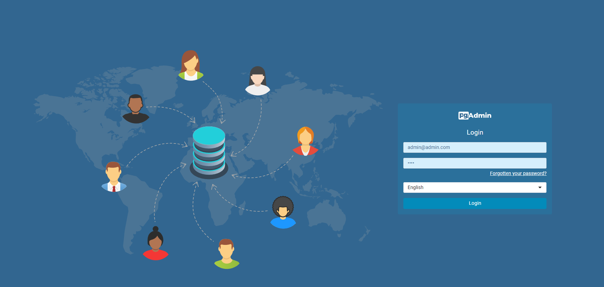
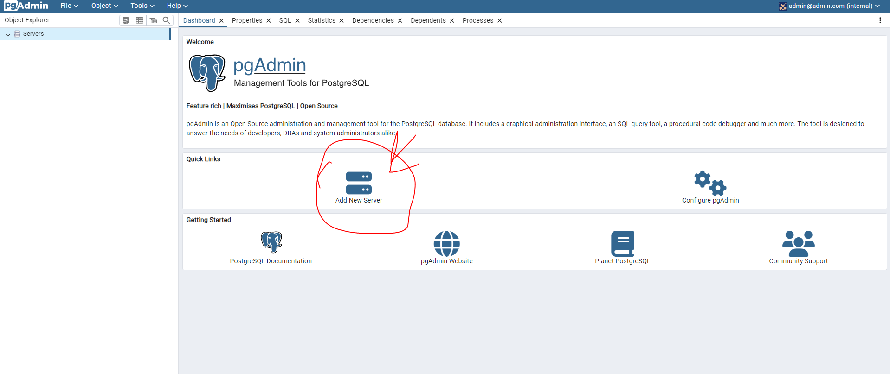
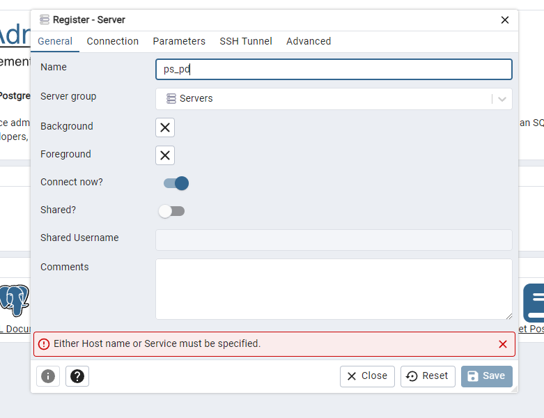
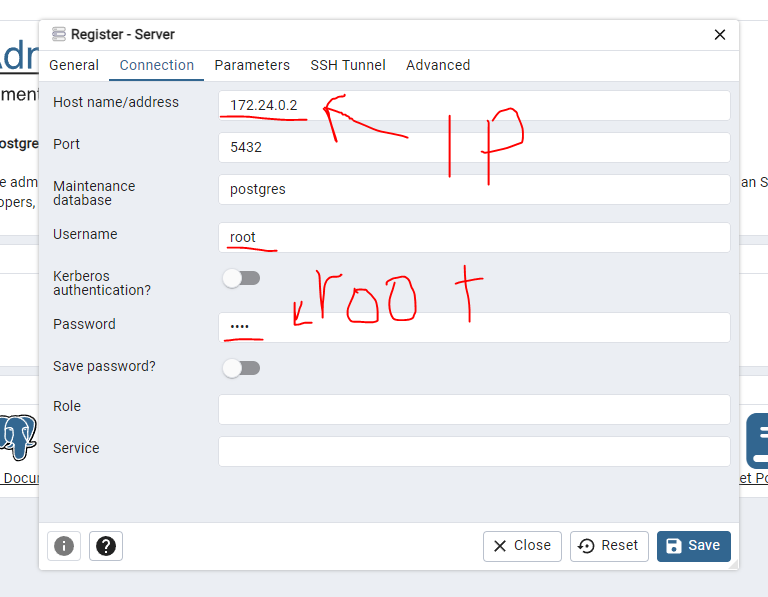
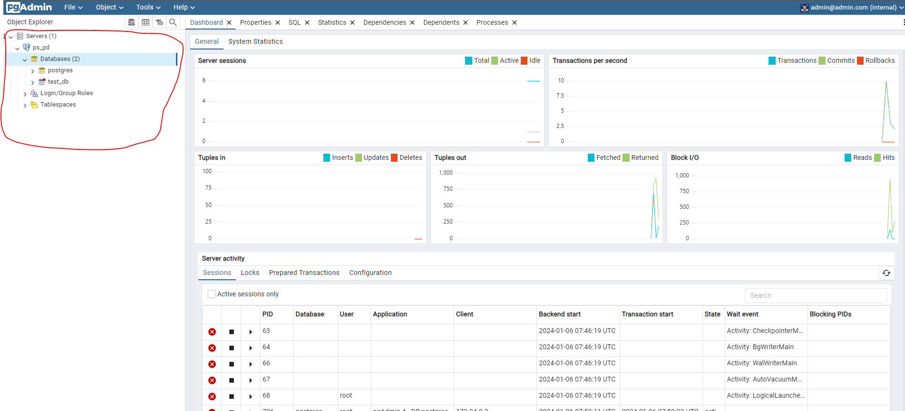

# Docker Setup for PostgreSQL and pgAdmin4

This guide walks you through setting up Docker containers for PostgreSQL and pgAdmin4.
---
---

## Installation and Setup
---
1. **Install Docker Desktop**:
    - Download and install Docker Desktop from the official website: [Docker Desktop](https://www.docker.com/products/docker-desktop).

2. **Start Docker**:
    - Open Docker Desktop and wait until it indicates that it is running.

3. **Setup Docker Containers**:
    - Open a terminal or command prompt.
    - Navigate to the directory containing your `docker-compose.yml` file.
    - Run the following command to start the Docker containers for PostgreSQL and pgAdmin4:
      ```bash
      docker-compose up -d
      ```
    - This command will download the necessary Docker images and start the containers in detached mode.

4. **Run the IP Address Script**:
    - After the containers are up and running, execute the `get_docker_ip.py` script to retrieve the IP address of your postgres container.
    - In your terminal, run:
      ```bash
      py get_docker_ip.py
      ```
    - This script will output the IP address of the pgAdmin4 container, which we will use to add the postgres IP server to pgAdmin4.

---

## Usage
---
- **Access pgAdmin4**:
    - Open a web browser and go to `http://localhost:5050`.
 - **Web Credentials**:
    -  Email: `jeton@jeton.com`  
    - Password: `JetonDauti`
 - **Database Credentials**:
    -  Username: `JetonDauti`
    - Password: `JetonDauti`

## Step 1
Login in to go in dashboard.



## Step 2
Add postgres server.



## Step 3
In terminal run : `py get_docker_ip.py`. It will show the posgres server ip: `IP Address: <IP>`



## Step 4
Add the Postgres IP here.



## Step 5
Access the postgres db in pgadmin4 dashboard



---
